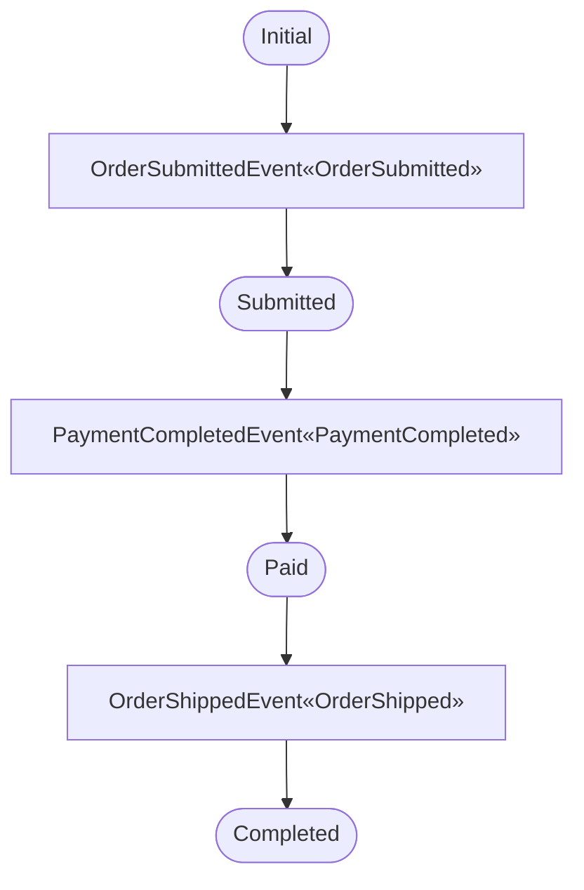

import Footer from '@catalog/components/footer.astro';

## Overview

This event starts the order submitted saga 

```mermaid
flowchart TB;  
    0(["Initial"]) --> 4["OrderSubmittedEvent«OrderSubmitted»"];  
    1(["Submitted"]) --> 5["PaymentCompletedEvent«PaymentCompleted»"];  
    2(["Paid"]) --> 6["OrderShippedEvent«OrderShipped»"];  
    4["OrderSubmittedEvent«OrderSubmitted»"] --> 1(["Submitted"]);  
    5["PaymentCompletedEvent«PaymentCompleted»"] --> 2(["Paid"]);  
    6["OrderShippedEvent«OrderShipped»"] --> 3(["Completed"]);
```

<NodeGraph />

<Footer />